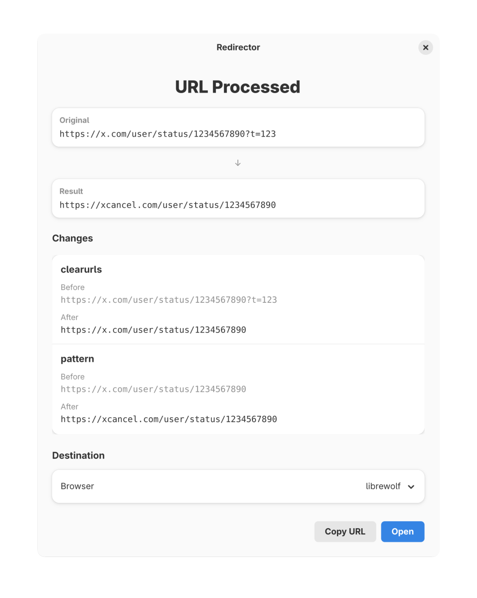

<h1 align="center">Redirector</h1>

A Linux app that can be set as your default browser to intercept URLs and automatically apply transformations before they open in your browser of choice. Like [URLCheck](https://github.com/TrianguloY/URLCheck) for the desktop.

Built with Rust and GTK4/Libadwaita, Redirector runs a modular processing pipeline over URLs: stripping tracking parameters via ClearURLs rules, applying custom regex transformations, and optionally routing them to specific browsers through automation rules. It presents a clean dialog showing the original URL, the result, and a log of every change made.

<p align="center">
   
</p>

## Configuration

Config files are loaded from `${XDG_CONFIG_HOME:-~/.config}/redirector`.

- **`patterns.json`** — Regex search-and-replace patterns applied to URLs. Each top-level key is a pattern name:

  ```json
  {
    "x -> xcancel": {
      "regex": "x\\.com",
      "replacement": "xcancel.com",
      "enabled": true
    }
  }
  ```

  | Field | Type | Description |
  |---|---|---|
  | `regex` | `string` | Regex pattern to match against the URL |
  | `replacement` | `string` \| `string[]` | Replacement string (use capture groups like `$1`). If an array, one entry is picked at random |
  | `enabled` | `bool` (optional) | Whether to apply this pattern (default: `true`) |

- **`automations.json`** — Automation rules that match URLs via regex and automatically open them in a specific browser. Each top-level key is a rule name:

  ```json
  {
    "Open Twitter in Tor": {
      "regex": "twitter\\.com|xcancel\\.com",
      "action": "open",
      "browser": "torbrowser"
    },
    "Open everything else in LibreWolf": {
      "regex": ".*",
      "action": "open",
      "browser": "librewolf",
      "stop": true
    }
  }
  ```

  | Field | Type | Description |
  |---|---|---|
  | `regex` | `string` \| `string[]` | Regex pattern(s) to match against the URL |
  | `action` | `string` | Action to take (currently only `"open"` is supported) |
  | `browser` | `string` (optional) | Desktop ID of the browser to use (without `.desktop` suffix). Omit to use the system default |
  | `stop` | `bool` (optional) | Stop processing further rules after this one (default: `false`) |
  | `enabled` | `bool` (optional) | Whether to evaluate this rule (default: `true`) |
  | `args` | `object` (optional) | Additional module-specific arguments |
